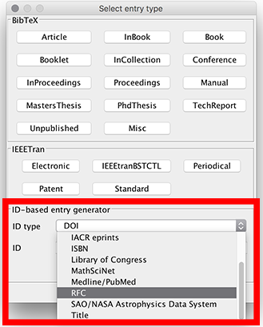


Since: 4.3


# Creating entries from RFC

[IETF \(Internet Engineering Task Force\)](https://datatracker.ietf.org/) Datatracker is a database that "contains data about the documents, working groups, meetings, agendas, minutes, presentations, and more, of the IETF."

To use this feature, choose **BibTeX → New entry...**. In the lower part, there is the box "ID-based entry generator". In the field "ID type", "RFC" can be selected \(see screenshot below\). Select the field "ID" and enter the RFC here, with or without the "rfc" prefix \(e.g. `1954`, `rfc1954`\) and press Enter to generate an entry based on the Id. You can also click on "Generate". The found entry is opened in an entry editor. In case an error occurs, a popup is shown.

