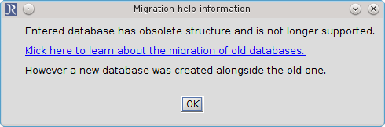

# Migration of old databases into shared database

## Context

This situation occurs when you try to open an SQL database which was created with JabRef version older than 3.6.

With release of [JabRef 3.6](https://github.com/JabRef/jabref/releases/tag/v3.6) the SQL database structure has been changed.
So all databases with an old structure are not longer supported.

## Migration

To migrate your old database into new shared database you will have to follow these steps:

-	Download and install [JabRef 3.5](https://github.com/JabRef/jabref/releases/tag/v3.5)
-	Open JabRef and goto **File** -> **Import from external SQL database**
-	Enter required data and klick on **Connect**
-	Choose the database which should be imported and press **Import**
-	Save the database locally (**File** -> **Save database**)
-	Turn back at least to [JabRef 3.6](https://github.com/JabRef/jabref/releases/tag/v3.6)
-	Goto: **File** -> **Open shared database**
-	Enter required data and klick on **Connect**
-	Now goto **File** -> **Import into current database**
-	Choose the file you saved locally and import it

After that the content is available on shared database and you can work live on it.
