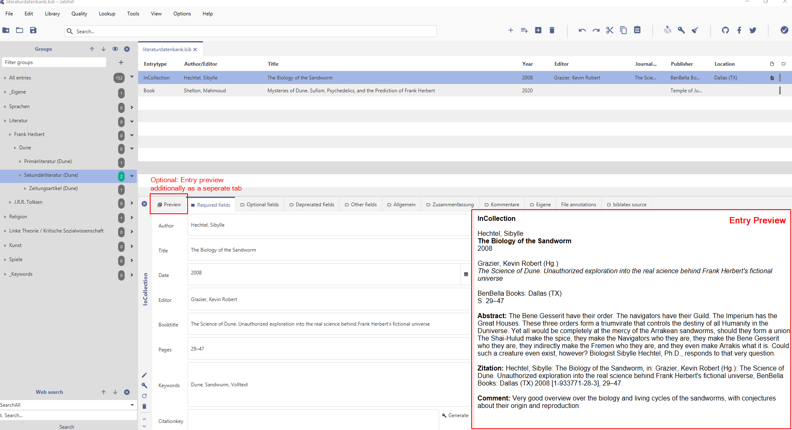
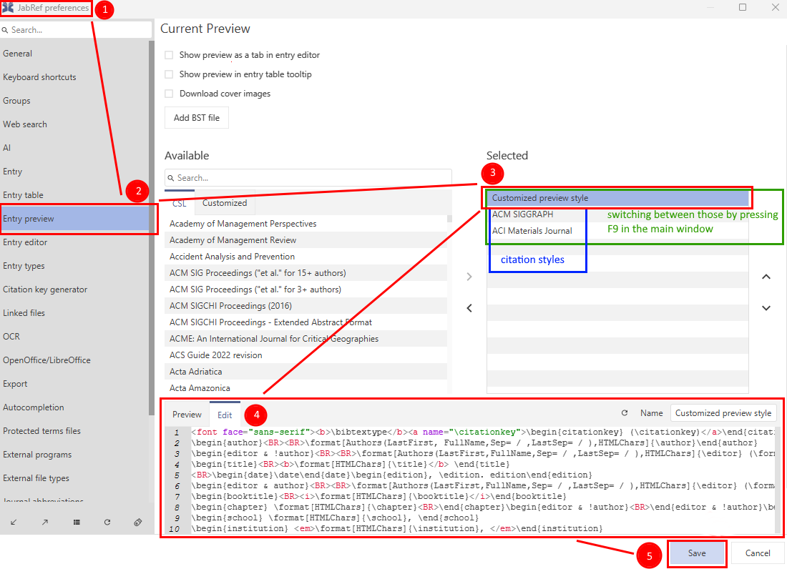
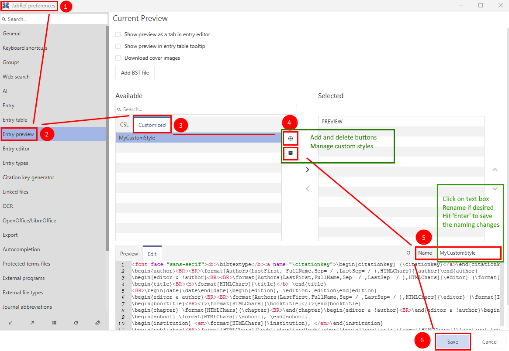

# Entry preview setup

## Location

The **Entry Preview** is located inside the **Entry Editor** (except when navigated to the `File annotations` or `{} biblatex source` tab):

You can display the entry preview as a separate tab (see screenshot above) by checking the box `Show preview as a tab in entry editor` in the entry preview settings `Options > Preferences > Entry preview > Current Preview` (see screenshot below).

## Layouts/Styles

The entry preview displays either the **Customized Preview Style** or a certain **Citation Style**. You can select the styles that should be available for display in **Options → Preferences → Entry preview**. In `Available` you find all styles selectable for display, in `Selected` all styles already selected for display:

You can switch between all selected styles (customized preview and citation styles) in the entry preview in the main window by pressing `F9`.

## Display Mechanism

The layout is automatically created using the same mechanism as used by the [Custom export filter](../collaborative-work/export/customexports.md) facility. When previewed, an entry is processed using one of the selected layouts/styles to produce HTML code which is displayed by the preview panel.

## Modification of the Customized Preview Style

To customize the appearance and contents of the customize entry preview you need to edit/modify the customized preview style in the entry preview settings (see screenshot above) using the custom export filter syntax described in the [Documentation](../collaborative-work/export/customexports.md).

## Add or Delete Customized Preview Styles

To add a custom preview style `Options → Preferences → Entry preview → Customized Tab → '+' (add button)`. To delete a custom preview style, `Options → Preferences → Entry preview → Customized Tab → Select custom style  under the 'Customized' tab → '-' (delete button)`. Note that you can only add or delete custom styles under the 'Customized' tab.

## Rename Customized Preview Styles

To rename a custom preview style `Options → Preferences → Entry preview → Customized Tab → Under this tab, select custom style to rename → 'Name' text box → Type name → Hit 'Enter'` Note you may only rename styles under the 'Customized' Tab. Duplicate names are not allowed
