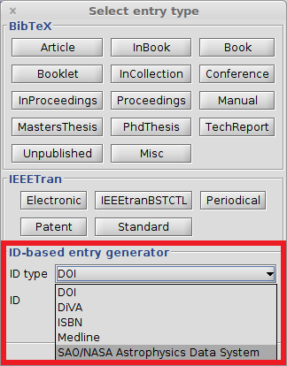

# SAO/NASA Astrophysics Data Systemを使用して項目を作成するには

[SAO/NASA Astrophysics Data System](http://www.adsabs.harvard.edu/)は，査読付きおよび査読無しのソースから収集した800万を超える天文学・物理学論文のオンラインデータベースです．概要は，ほぼ全ての論文についてオンラインで無料閲覧することができ，スキャンした完全な論文は，古い論文について，Graphics Interchange Format (GIF)およびPortable Document Format (PDF)形式で閲覧可能です（[Wikipedia](https://en.wikipedia.org/wiki/Astrophysics_Data_System)）．

この機能を使用するには，**BibTeX→新規項目...** を選択すると，下部に「IDから項目を生成」ボックスがあるので，「ID型」フィールドで「SAO/NASA Astrophysics Data System」を選択します（下記スクリーンショットを参照）．
「ID」フィールドにSAO/NASA Astrophysics Data System IDを入力し（例：`2013Sci...339..671W`），<kbd>Enter</kbd>を押すと，IDに基づいて項目が作成されます．「生成」ボタンを押してもかまいません．
検出された項目が項目エディタに開かれます．
エラーが発生すると，ポップアップが表示されます．

