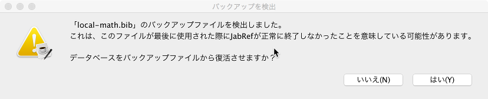

# バックアップ

## 目的

このモジュールは，_BibTeXデータベース_　での作業中，常にバックグラウンドで動いており，
ユーザーが操作をするごとに _バックアップコピー_ を作成して，それを最新に保っています．
例えば，フィールドに変更を加える時には，新しい値はバックアップコピーに保存されます．

 _BibTeXデータベース_ で作業中に，_JabRef_ が クラッシュしたものとしましょう．
 _JabRef_ がクラッシュした時に開かれていたファイルをサイド開こうとすると，次のようなダイアログが現れます．

ここで，通常であれば失われていた変更点を取り戻す機会が得られます．

## 註

既定でこの機能は有効にされており，ユーザーが設定しなくても常に実行されています．
[gitignore.io](https://www.gitignore.io/)サービスを使用すれば，https://www.gitignore.io/api/jabref を開くことで，適切な`.gitignore`ファイルが生成されます．

## Offstage

`.bib`ファイルを開くと，_JabRef_ は同時に`.sav`ファイルを生成し，これが現在のバッファとして使用されます．
_JabRef_ が正常に閉じられると，`.sav`ファイルは削除されます．
正常に閉じられなかった場合には，このファイルが，次回のデータベース回復に用いられます．
