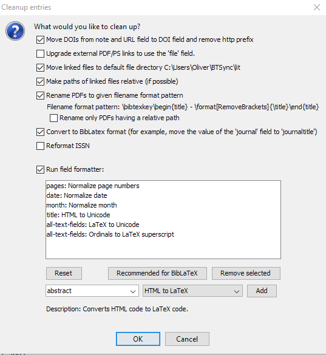

# 項目の剪定

JabRefはデータベースの項目を剪定することができます．

項目の剪定を実行するには，**品質→項目の剪定...** を開いてください．

下部では「フィールド整形を実行」を選択することができ，そこでは様々な[保存時動作](SaveActions)を選択することができます．
データベースモードに依存して，「BibTeXに対する推奨」か「BibLaTeXに対する推奨」ボタンが表示されますが，これを押すと，各モード用に推奨される剪定が呼び出されます．
