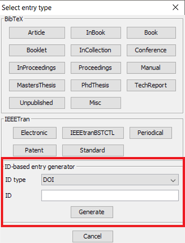

# Digital Object Identifier (DOI)を使用して項目を作成するには

この機能を使用するには，**BibTeX→新規項目...** を選択すると，下部に「IDから項目を生成」ボックスがあります．
そこの「ID型」フィールドで「DOI」がすでに選択されているのを確認し，「ID」フィールドにフォーカスがあることを確認します．
その「ID」フィールドにDOIを入力し，<kbd>Enter</kbd>を押すと，IDに基づいて項目が作成されます．「生成」ボタンを押してもかまいません．
すると，（<http://crossref.org/>が提供している）<http://dx.doi.org/>が，与えられたDOIをBibTeX項目に変換します．
そして，検出された項目が項目エディタに開かれます．
エラーが発生すると，ポップアップが表示されます．

