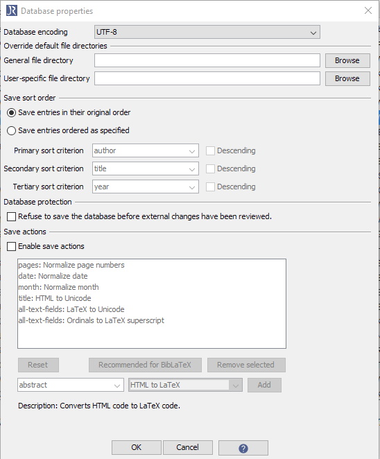

# データベース特性ウィンドウ

各データベースには，固有の特性を持たせることができ，
**ファイル → データベース特性** か，データベースタブを右クリックして「データベース特性」を選択することで修正することができます．これらの固有特性は，**オプション → 設定** で定義される一般特性を上書きします．

データベース特性ウィンドウでは，データベースに関連した設定を行うことができます．

データベース固有の特性は，データベース本体内に保管されます．そのため，データベースを他のコンピューターに移したとしても，これらの特性は保持されます．ほとんどの場合，これらは，*@Comment{jabref-meta:* で始まる文字列ブロックを使用して，bibファイルデータベースに保管されます．

## データベースのエンコーディング

この設定は，データベースをディスクに書き込む際，JabRefがどの文字エンコーディングを使うべきかを指定します．この設定を変更すると，このデータベースに関しては，この設定が，「JabRefの設定」ダイアログで行った設定よりも優先して用いられます．JabRefはエンコーディングをbibファイルの冒頭部に書き込み，次回このファイルを開いたときに正しいエンコーディングで開くことができるようにします．

ドロップダウンメニューからエンコーディングを一つ選択できます．`UTF-8`が強く推奨されます．

## ファイルディレクトリ既定値の上書き

データベースでは，PDFなどのファイルを項目にリンクさせることができます．これらのファイルの目録は，項目の *file* フィールドに保管されます．これらのファイルの場所を指定しなくてはなりません．

データベースには，**一般ファイルディレクトリ** と **ユーザーファイルディレクトリ** を定義することができます．これらの設定は，設定ダイアログの *標準ファイルディレクトリ* を上書きします．

**一般ファイルディレクトリ** は，共有データベースの全ユーザーに共通のパスです．**ユーザーファイルディレクトリ** は，データベースの各ユーザーが持つことのできる専用のファイルディレクトリです．これが定義されていると，**一般ファイルディレクトリ** は上書きされます．

JabRefは，**ユーザーファイルディレクトリ** とともに，使用中のシステム名を記憶します．これは，データベースの各ユーザーが別々のシステム名を使用していることを前提としています．例えば，*laptop* というコンピューターを使用しているとき，bibファイル中の項目は，@Comment{jabref-meta: fileDirectory-jabref-laptop:\\somedir;} のようになります．

相対ディレクトリを指定することは可能です．この場合，ファイルの場所は，bibファイルのある場所からの相対パスとして解釈されます．ディレクトリを「.」に指定すると(除く括弧)，ファイルがbibファイルと同じディレクトリにあることを意味します．

*《註》旧来のPDF/PSリンク(すなわち，JabRef第2.3版以前で用いられていた，*pdf* フィールドおよび *ps* フィールドは，現行版では，一般ファイルリンクに置き換えられなくてはなりません．* これは，**品質 → 項目を整頓...** で *外部PDF/PSリンクを「file」フィールドを用いるように更新* を有効にすることで為し得ます．

## 整序順の保存

**項目をオリジナルの順序で保存** を有効にしておくと，データベースを保存する際，項目順は保持されます．一方，**項目を指定順に保存** を選択すると，3つの基準で項目を整序することができます．各基準については，使用するフィールドを入力して，並び順を選択することができます．

## データベース保護

あなたが共有データベースを編集している間に，他のユーザーもそれを編集している可能性があります．既定では，データベースを保存すると，他のユーザーが行なった変更点を破棄してしまいます（変更が加えられている旨の警告メッセージは表示されます）．

加えた変更を望まぬうちに破棄してしまうことのないように，そうして円滑な共同作業ができるように，*データベースを保存する前に，外部から加えられた変更点の審査を強制する* を選択することができます．この設定を行うと，データベースを保存する前に，外部から加えられた変更を常に審査するように強制します．ユーザーは，外部から加えられた変更を審査し，マージまたはリジェクトした上でないと，データベースを保存することができません．

*《註》* 本機能は，セキュリティ機能を提供するものではなく，他のユーザーが加えた変更を意図せずに上書きしてしまうのを避ける機会を提供するだけです．本機能は，悪意を持ったユーザーからあなたのデータベースを守るわけではありません．

## 保存アクション

データベースを保存する際，フィールドの書式を整頓することができます．これによって，項目が整合性のある書式を維持するようにできます． **保存アクションを有効化** をチェックすると，アクションのリストを設定できるようになります．各アクションは，下記によって定義できます．
- 項目フィールド（アクションが適用されるフィールド）
- 実行されるアクション型（例：*HTMLからLaTeXへ*：これは，ウィンドウ中に説明されている通り，HTMLコードをLaTeXコードに変換します）

## 共有SQLデータベース

共有[SQLデータベース](http://help.jabref.org/en/SQLDatabase)特性の中には，*.bib* ファイルでは処理できないために，使用できないものがあります．下記の特性は使用できません：
- データベースエンコーディング *（つねにUTF-8）*
- 整序順の保存
- データベース保護
