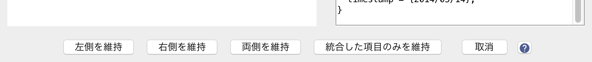

# 重複の検出

JabRefは，データベース中の重複項目を検出することができます．

この機能には，**品質→重複を検索** によって，直接アクセスすることができます．これは，サポートされている文献ファイル形式や直接インターネットから[新規項目を読み込む](ImportInspectionDialog)時にも使用されます．

重複候補の検出には，編集距離アルゴリズムが用いられます．*author*・*editor*・*title*・*journal* の各フィールド上に追加の重みを加えます．

## 重複候補の比較表示

重複の可能性がある項目どうしが見つかると，それらのフィールドが並べて表示されます．

ウィンドウの右上隅にあるドロップダウンメニューを使うと，２つの項目の相違点を強調表示することができます．
相違点の表示には，以下の５つの方法があります．

- **平文**: 強調なしにそのまま
- **差異を表示** - 単語：差異は右側の項目に表示されます．左側で削除されている分は，単語全体が赤字で取消線を引かれ，右側で追加されている分は青で下線が引かれます．
- **差異を表示** - 文字：差異は右側の項目に表示されます．上記と同様ですが，各文字が赤字で取消線を引かれ，あるいは青字で下線が引かれます．
- **差異を対象表示** - 単語：差異は両側に表示されます．単語を対象として下線が引かれ，着色されます．
- **差異を対象表示** - 文字：差異は両側に表示されます．単語を対象として下線が引かれ，着色されます．

中央の段のラジオボタンでは，各フィールドのどちら側を維持するかを選択することができます．選択肢は，**左側**・**右側**・**なし** です．
既定では，左側の項目が維持され，左側の項目に存在しない全てのフィールドが右側の項目から取得されます．

## 統合された項目：プレビューとソースコード

あなたの選択を反映して，統合された項目が，プレビュー（左側）とソースコード（右側）の形で表示されます．

プレビューを右クリックすると，**項目プレビューを印刷** するか **プレビューをコピー** することができます．

## どの項目を維持するかを選択する

以下の選択肢があります：

- **完全に同一な重複を自動削除**．このボタンは，完全に同一な重複がある場合に表示されます．クリックすると，完全に同一な重複を削除します．
- **左側を維持**．右側の項目を削除します．
- **右側を維持**．左側の項目を削除します．
- **両側を維持**．２つの項目が重複ではないものとして扱います．
- **統合した項目のみを維持**．統合した項目を最良のものとみなし，古い項目は両方とも削除されます．
- **取消**．重複の検索を直ちに停止します．
