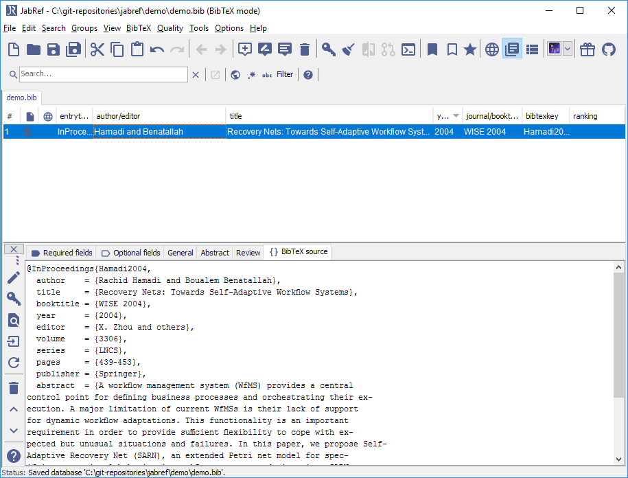
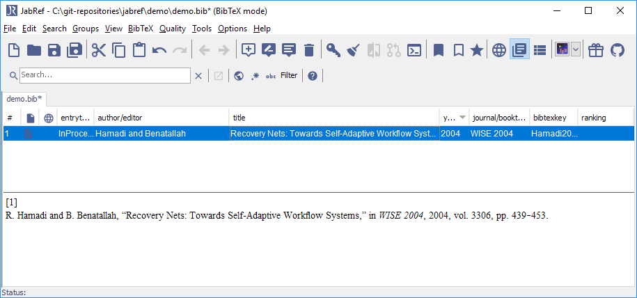

# リンクされていないファイルを検索

この機能は，**品質→リンクされていないファイルを検索...** で利用できます．

以下の説明は，[tex.stackexchange.com](http://tex.stackexchange.com/a/344310/9075)が初出です．

## 準備：JabRef鍵の生成パターンを必要に応じて調整

JabRefは，BibTeX鍵の生成と[BibtexKeyPatterns](BibtexKeyPatterns)に説明されているような様々なパターンを提供しています．

## PDFをbibファイルにリンク

1. .bibファイルを作成するか開く．

1. 「品質」→「リンクされていないファイルを検索」を開く．

1. 「リンクされていないファイルを検索」ダイアログが開く．

1. 「一覧」ボタンを押して，ディレクトリを選択する．

1. 「ディレクトリを走査」をクリックする．

1. 「ファイルを選択」に，データベースに取り込まれていないファイルが表示されます．

1. 全ファイルに項目を作成する場合は，「適用」をクリックします．

1. 各ファイルについて，下記にような読み込みダイアログが表示されます． 
   
  ダイアログには，PDFの「XMP-metadata」領域に保管されているXMPメタデータが表示されます．
  このデータが必要に合致していれば，「XMPデータに基づいて項目を生成」を選択します．
  通常，XMP-metadataは，十分な質を備えていません．
  その場合は「内容に基づいて項目を生成」を選択してください．

1. 「OK」をクリックして，読み込みを始めてください．

1. リンクを求める下記のようなダイアログが開きます． 
   
  ファイルが今ある場所に維持するには，「ファイルを現ディレクトリに残す」を選択できます．多くの場合，これが望まれる挙動です．
  「ファイルをファイルディレクトリに移動」を選択した場合には，ファイル名を生成されたBibTeX鍵に変更することができます．

1. OKを押して，ファイルをBibTeX項目にリンクします．

1. これは，各ファイルに対して行われます．その後，「リンクされていないファイルを検索」ダイアログが表示されますので，「閉じる」をクリックして閉じます．

1. 最後に読み込まれた項目が表示された状態の項目エディタが表示されます．
  

1. 以上でファイルを保存して終了することができます．

1. オプション：リンクされたファイルを見るには，「General」をクリックしてください．
  

1. オプション：BibTeXソースを見るには「BibTeXソース」をクリックしてください．
  

1. オプション：項目表の項目を見るには，項目表を縮小する必要があります．JabRefウィンドウを大きくして，項目エディタの上の縁をマウスで動かしてください．
  

1. オプション：項目プレビューを表示するには，<kbd>Esc</kbd>を押してください．
  

## 詳しい情報

### PDFに対する注力

中身に基づく読み込みプログラムは，IEEEおよび[LNCS](https://github.com/latextemplates/LNCS)書式の論文用に書かかれました．
他の書式は（まだ）サポートされていません．
最初のページにDOIが見つかった場合には，BibTeX情報を生成するのにDOIが用いられます．

次の開発段階としては，PDFのタイトルを抽出して「DOIの検索」を行い，さらに[DOIからBibTeXデータを取得するには](GetBibTeXDataFromDOI)に書かれているJabRefの機能を用いてBibTeXデータを取得できるようにすることです．

それに加えて，別のライブラリを使用してコードを完全に置き換えることを[考えています](https://github.com/koppor/jabref/issues/169)．
これは多くの労力を必要とし，これに向けてのタイムラインはまだ存在しません．

### 良いファイル名

JabRefでは，ファイル名の変更も可能です．変更パターンを，設定→読み込みで調整することができます．

「パターンを選択」を押して，「bibtexkey - title」を選択します．

これは以下のような設定になります：`\bibtexkey\begin{title} - \format[RemoveBrackets]{\title}\end{title}`.

こうすると，ファイル名は，bibtex鍵で始まった後にフルタイトルが続きます．
上述のbibtex鍵にはすでにタイトルが含まれているので，実践的には`\bibtexkey`のみの方が良い選択肢かもしれません．

### Mr.DLib

JabRefはかつて，BibTeXのフル項目やPDFを返す[Mr.DLib](http://mr-dlib.org/)をサポートしていましたが，
使用しているライブラリの著作権の状況が不透明なため，このサービスは取り止められました．
さらに，Mr.DLibは注力する点を変更し，推奨文献を提供するようになります．
<https://help.jabref.org/en/EntryEditor#related-articles-tab>を参照してください．

### スタックオーバーフロー上の関連する質問

* [Extract titles from each page of a PDF?](http://stackoverflow.com/q/18071127/873282)
* [Zotero: Extract references from PDF and create new library items from them](https://forums.zotero.org/discussion/16277/extract-references-from-pdf-and-create-new-library-items-from-them)
* [Is there an open source tool for producing bibtex entries from paper PDFs?](http://academia.stackexchange.com/questions/15504/is-there-an-open-source-tool-for-producing-bibtex-entries-from-paper-pdfs)
* [Extracting information from PDFs of research papers](http://stackoverflow.com/questions/1813427/extracting-information-from-pdfs-of-research-papers/3523416)
