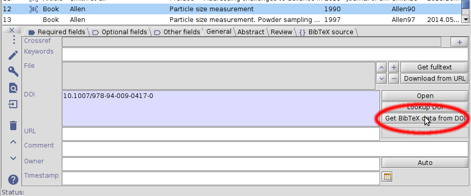
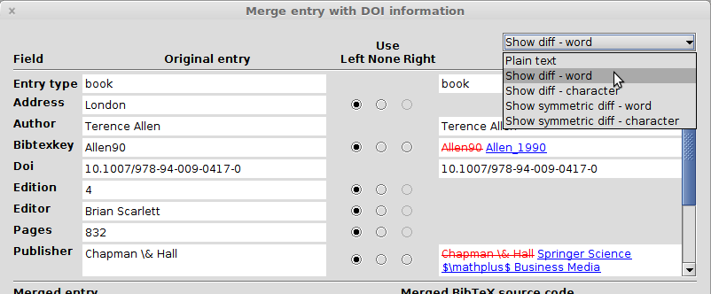
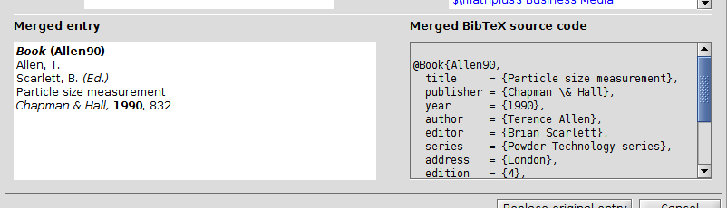
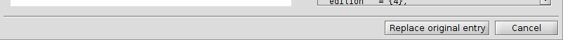

# DOIからBibTeXデータを取得するには

JabRefは，DOIを使用して項目の残りを埋める手助けすることができます．

[項目エディタ](EntryEditor)を開き，Generalタブの中で **DOIからBibTeXデータを取得** ボタンをクリックします．
*当然のことながら，この機能は，当該項目に既にDOIが入力済みの時のみ使用できます．*

**項目をDOI情報を統合** ウィンドウが開きます．

## 項目フィールドとDOIから集めた情報の並列表示

元の項目のフィールドと，DOIから集めた情報のフィールドが，ウィンドウ上部に左右に並べて表示されます．

両側の差異は，ウィンドウ右上隅にあるドロップダウンメニューを使って強調することができます．
差異の表示には，以下の5つの方法があります．

- **平文**：そのまま，強調なし
- **差異を表示** - 単語：差異は右側に表示されます．元の項目から単語が削除されている場合には，その単語全体に赤い取消線が引かれます．単語がDOIから集めた情報で追加されている場合には，青い下線が引かれます．
- **差異を表示** - 文字：差異は右側の項目に表示されます．上記と同様ですが，文字ごとに赤線や青線が引かれます．
- **差異を対照表示** - 単語：差異は両側に表示されます．単語ごとに色付きで下線表示されます．
- **差異を対照表示** - 文字：差異は両側に表示されます．文字ごとに色付きで下線表示されます．

列中央にラジオボタンがあるので，**左側**・**右側**・**なし** で，各フィールドにどちら側を採用するのかを選択することができます．
既定では，元の項目（左）が採用され，元の項目に存在しないフィールドは，全てDOIから集めた情報から採用されます．

## 統合後の項目：プレビューとソースコード

選択を反映した統合後の項目が，プレビュー（左側）とソースコード（右側）の形で表示されます．

プレビューを右クリックすると，**項目プレビューを印刷** したり， **プレビューをコピー** したりすることができます．

## 統合の決定

最後に，どちらのフィールドを採用するかを選択した後，**項目の統合** を押して決定することができます．決定しない場合には，**取消** を押すことができます．

[重複の検出](FindDuplicates)と[項目の統合](MergeEntries)も参照のこと．
