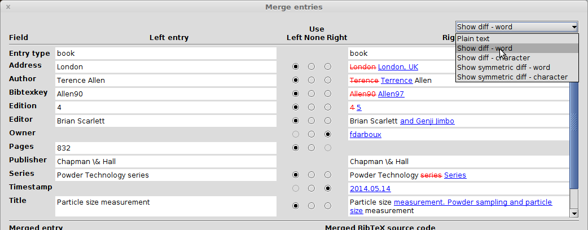
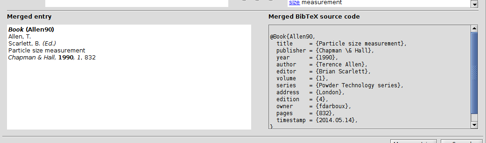

# 項目の統合

JabRefは，データベース項目の統合を手助けすることができます．

まず，統合する2つの項目を選択してください．それから **品質→項目の統合...** メニューを選択してください．
すると，**項目の統合** ウィンドウが現れます．

## 項目フィールドの並列表示

2つの項目のフィールドが，ウィンドウ上部に左右に並べて表示されます．

2つの項目の差異は，ウィンドウ右上隅にあるドロップダウンメニューを使って強調することができます．
差異の表示には，以下の5つの方法があります．

- **平文**：そのまま，強調なし
- **差異を表示** - 単語：差異は右側の項目に表示されます．左側の項目から単語が削除されている場合には，その単語全体に赤い取消線が引かれます．単語が右側の項目で追加されている場合には，青い下線が引かれます．
- **差異を表示** - 文字：差異は右側の項目に表示されます．上記と同様ですが，文字ごとに赤線や青線が引かれます．
- **差異を対照表示** - 単語：差異は両側に表示されます．単語ごとに色付きで下線表示されます．
- **差異を対照表示** - 文字：差異は両側に表示されます．文字ごとに色付きで下線表示されます．

列中央にラジオボタンがあるので，**左側**・**右側**・**なし** で，各フィールドにどちら側を採用するのかを選択することができます．
既定では，左の項目が採用され，左側の項目に存在しないフィールドは，全て右側の項目から採用されます．

## 統合後の項目：プレビューとソースコード

選択を反映した統合後の項目が，プレビュー（左側）とソースコード（右側）の形で表示されます．

プレビューを右クリックすると，**項目プレビューを印刷** したり， **プレビューをコピー** したりすることができます．

## 統合の決定

最後に，どちらのフィールドを採用するかを選択した後，**項目の統合** を押して決定することができます．決定しない場合には，**取消** を押すことができます．

[重複の検出](FindDuplicates)も参照のこと．
