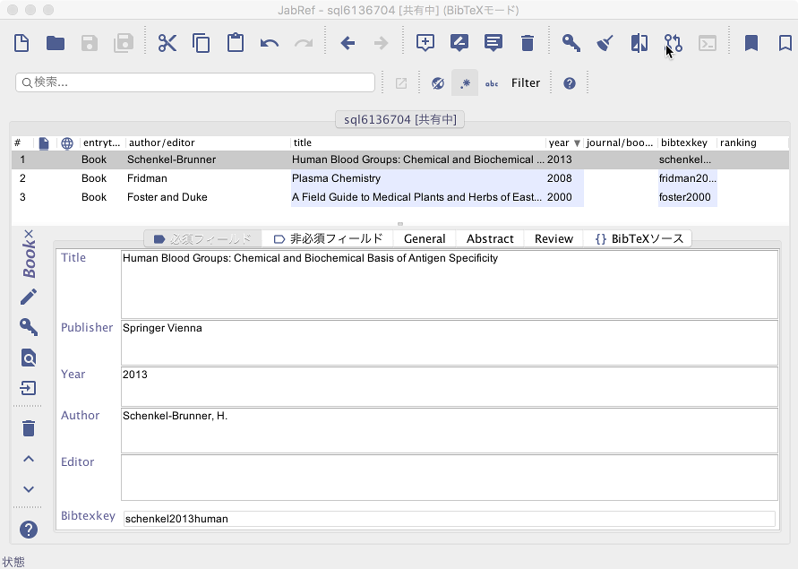

# 共有SQLデータベース

JabRefでは，共有SQLデータベースを用いることで，共同作業をサポートすることができます．
この機能は，JabRef 3.6以降で利用できます．
JabRefの旧版を利用していたことがあれば，データを更新する方法について，[第3.6版以前のSQLデータベースから共有データベースへの移行](SQLDatabaseMigration)をご覧ください．

## 使用法

この機能を利用するためには，リモートのデータベースに接続する必要があります．
そのためには，メニューバーから**ファイル**を開いて，**共有データベースを開く**をクリックします．
**共有データベースを開く**ダイアログが開くので，そこに共有データベースへの接続設定を書き込みます．
**データベース型**フィールドでは，ご利用の共有データベースに合わせて，PostgreSQL・MySQL・Oracleのいずれかを選択することができます．
それから，残りのフィールドを対応する情報で埋めます．
ご希望であれば，**パスワードを記憶しますか？**チェックボックスを有効にすることで，パスワードを保存することができます．

共有データベースに接続した後，主幹ウィンドウはこのようになります：

JabRefは，あなたが変更を加えたのを自動的に検知して，共有側にプッシュし，
同時に，新しいバージョンが共有側にあるかどうかを，つねにチェックします．
接続に問題がある場合には，アイコンバーにあるアイコンから，共有データベースを持ってくる(pull)ことができます．
新しいバージョンがある場合には，JabRefは，新しいバージョンとローカルにあるコピーを自動的に統合(merge)します．
これに失敗すると，**更新拒否**というダイアログが表示されます．
この場合，**更新拒否**ダイアログを使って，手動で統合を行う必要があります．
このダイアログは，差異がどこにあるかを表示しますので，ローカル版を維持したいか，共有版に更新したいかを選択します．
その後，**項目を統合**をクリックして，統合することを確認してください．

**更新拒否**ダイアログは，作業中のBibEntryが共有側で削除された場合，違う形で表示されます．
**維持**をクリックすれば，データベースのBibEntryを維持することができますし，そのまま**閉じる**をクリックすれば，共有側に合わせて削除することができます．

共有データベースへの接続に問題が生じると，**「接続が失われました」**というダイアログが表示されます．
そこで**再接続**・**オフラインで作業**・**データベースを閉じる**のいずれかを選択できます．
ほとんどの場合，再接続をすることで問題は解決されますが，うまくいかない場合には，**オフラインで作業**か**データベースを閉じる**かを選択しなくてはなりません．
自分の加えた変更点が確実に保存されるようにするには，**オフラインで作業**を選択してください．
保存すべきものがないと思えば，**データベースを閉じる**を選んでください．
オフラインで作業することを選んだ場合には，JabRefは，共有データベースを，ローカルの.bibデータベースに変換してくれます．
すると，もうオンラインではなくローカルデータベースで作業することになりますので，作業した内容は，コピー＆ペーストで共有データベースにインポートしてやる必要があります．
しかしながら，このように共有データベースにインポートを行う際には，自分がオフラインであった間に，変更が加えられたかどうかをチェックする必要があります．
さもないと，インポートによって，誰かの作業を上書きしてしまう恐れがあります．

## 試してみましょう

<https://www.freemysqlhosting.net>を使えば，共有データベースのサポートを体験できます．
