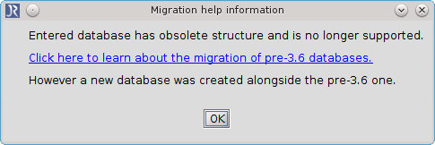

# 第3.6版以前のSQLデータベースから共有データベースへの移行

## 背景

ここで取り扱う状況は，第3.6版よりも古いJabRefで作成したSQLデータベースを開こうとするときに起こります．

[JabRef 3.6](https://github.com/JabRef/jabref/releases/tag/v3.6)のリリース時に，SQLデータベースの構造が変更されたため，第3.6版以前の構造を持つデータベースは，全てサポートされなくなりました．

## 移行

第3.6版以前のSQLデータベースから新しい共有データベースに移行するには，下記の手順に従ってください．

-	[JabRef 3.5](https://github.com/JabRef/jabref/releases/tag/v3.5)をダウンロードしてインストールします
-	JabRefを起動して，**ファイル** → **外部SQLデータベースから読み込む** を実行します
-	必要なデータを入力して，**接続** をクリックします
-	読み込むデータベースを選択し，**読み込む** を押します
-	データベースをローカルに保存します（**ファイル**→**データベースを保存**）
-	[JabRef 3.6](https://github.com/JabRef/jabref/releases/tag/v3.6)より新しい版に戻ります
-	**ファイル** → **共有データベースを開く** を選択します
-	必要なデータを入力して **接続** をクリックします
-	**ファイル** → **現在のデータベースに読み込む** を選択します
-	ローカルに保存したファイルを選択して，それを読み込みます

爾後，内容が共有データベース上で使用できるようになりますので，ライブで作業ができるようになります．
ライブ編集についての詳細な情報は，[SQLデータベース](SQLDatabase)にあります．
