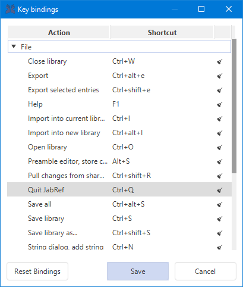

# Customize key bindings

This feature is available through **File → Preferences → Keyboard shortcuts**.

You can reset the keyboard shortcuts to default by pressing the "Default" button. This is especially useful when upgrading from a JabRef version before 3.8.2.

