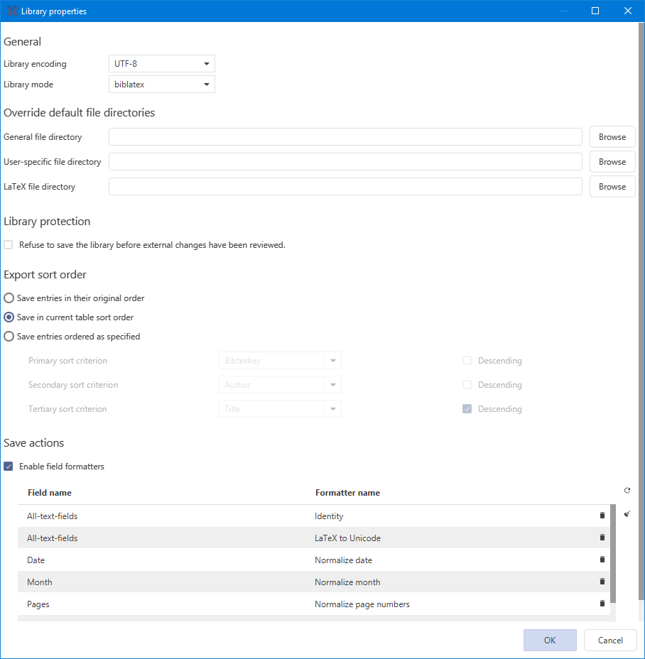

# Library properties

Each library can have specific properties that can be modified through **Library→ Library properties**. These specific properties override the generic properties defined in **Options → Preferences**.

The library-specific properties are stored in the database itself. This way, when moving the database to another computer, these properties are preserved. In most of cases these are stored in the bib-file database using text blocks starting with _@Comment{jabref-meta:_ .


**For shared SQL databases**, some properties are not available as they are not handled like a .bib file.  
The following properties are not available:  
- Database encoding \(always UTF-8\).  
- Library protection.  
- Save sort order. 


## General

### Library encoding

This setting determines which character encoding JabRef will use when writing this library to disk. Changing this setting will override the setting made in Preferences dialog for this database. JabRef specifies the encoding near the top of the bib file, in order to be able to use the correct encoding next time you open the file. The drop-down menu allows to select one encoding. 


UTF-8 is highly recommended


### Library mode

You can select if your library follow the [BibTeX or the biblatex format](../cite/bibtex-and-biblatex.md).

## Override default file directories

In your library, files \(PDF, etc.\) can be linked to an entry. The list of these files are stored in the _file_ field of the entry. The location of these files has to be specified.

For your library, you can define a **General file directory** and a **User-specific file directory**. These settings override the _main file directory_ defined in the Preferences dialog.

The **General file directory** is a common path for all the users of a shared database.  
The **User-specific file directory** allows each user to have its own file directory for the database. If defined, it overrides the **General file directory**.

JabRef stores the name of the current system alongside the **User-specific file directory**. This assumes that each user of the library has a different system name. For example, when using the computer _laptop_, the entry in the bib file is @Comment{jabref-meta: fileDirectory-jabref-laptop:\somedir;}

Relative directories can be specified. This means that the location of the files will be interpreted relative to the location of the bib file. Simply setting a directory to "." \(without quotes\) means that the files should reside in the same directory as the bib file.


The legacy PDF/PS links \(i.e. the pdf and ps fields, which were used in JabRef versions prior to 2.3\), should in current versions be replaced by general file links. This can be done using **Quality → Cleanup entries...** and enabling _Upgrade external PDF/PS links to use the 'file' field_.​


## Library protection​

While you edit a shared library, another user may be editing it too. By default, saving the library will overwrite changes done by others \(although a warning message about the changes will be displayed\).​

To avoid discarding changes involuntarily, and hence to allow a smooth collaborative work, you can choose to refuse to save the library before external changes have been reviewed. This setting lets you enforce reviewing of external changes before the library can be saved: users will only be able to save the library after any external changes have been reviewed and either merged or rejected.


**This is not a security feature**, merely a way to prevent users from overwriting other users' changes inadvertently. This feature does not protect your library against malicious users.​


## Save sort order

When saving the library, the order of the entries will be preserved if **Save entries in their original order** is selected. Alternatively, by selecting **Save entries ordered as specified**, you can choose to sort the entries using three criteria. For each criterion, you can type-in the field to be used and select the order.


Entries containing a `crossref` field will always be placed prior to the other entries. This is a necessary preliminary for BibTeX to be able to determine the correct referenced values. \(See: [Tame the BeaST](https://ctan.org/pkg/tamethebeast), p. 26\)


## Save actions

Field formatting can be tidied up when saving the library. That ensures your entries to have consistent formatting. If you check **Enable save actions**, the list of actions can be configured.

For more information see [Save Actions](../finding-sorting-and-cleaning-entries/saveactions.md).

